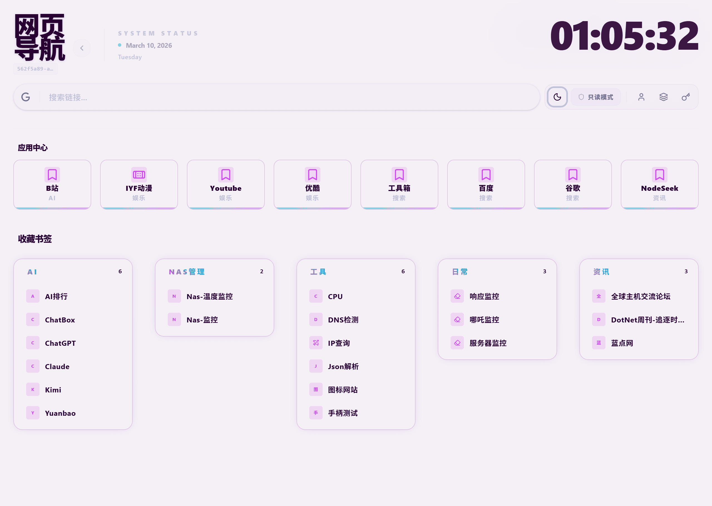
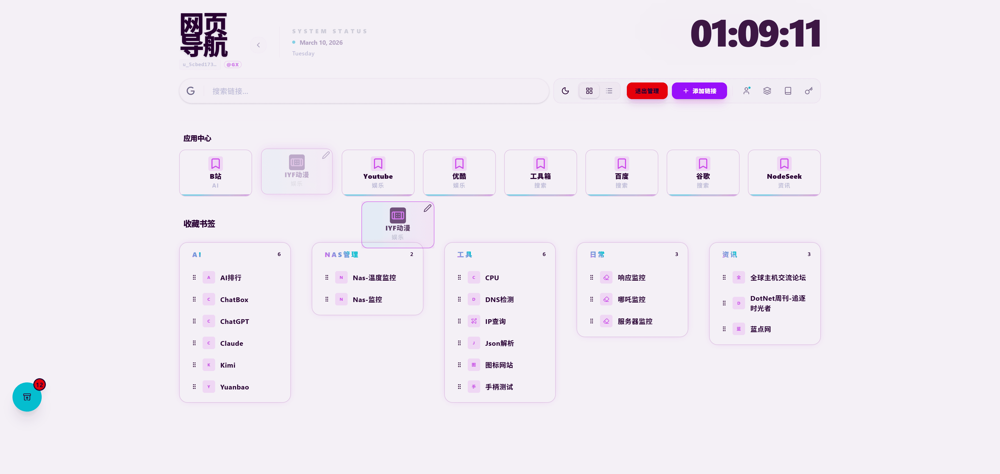
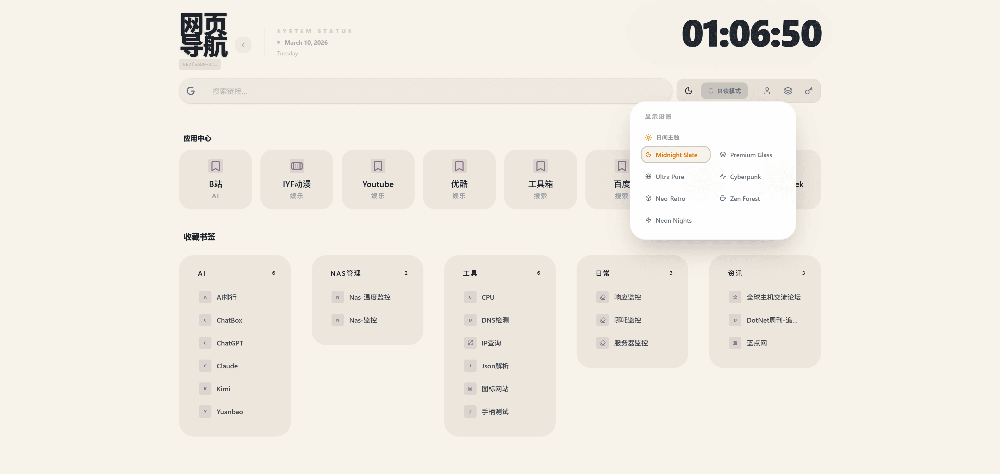
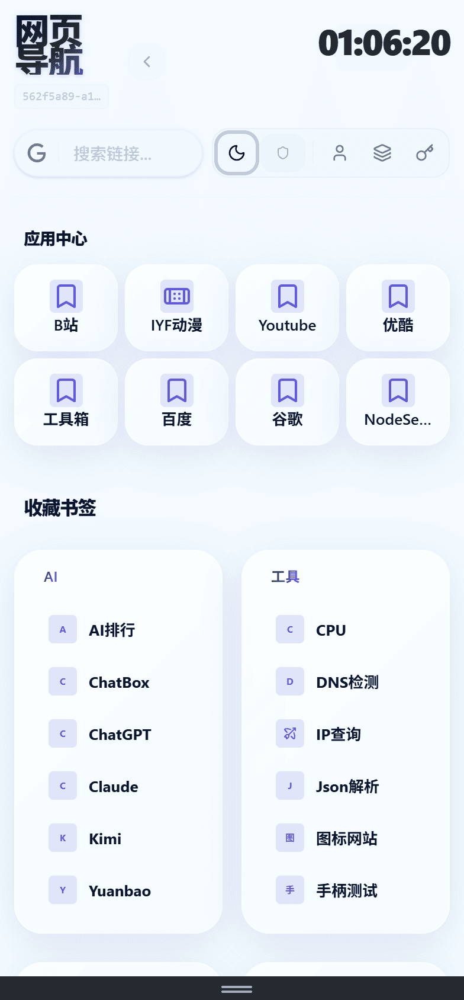

# Navigation

[**English Version**](README-en.md) | [**简体中文版**](README.md)

[**Update Log/更新日志**](Update.md)

## Introduction

Navigation is a lightweight navigation and bookmark management project built with .NET 10 (AOT) + Vue 3 (Vite SSG). The backend uses ASP.NET Core with an SQLite database and integrates Scalar to provide an elegant OpenAPI interface. The frontend is built with Tailwind CSS and Reka UI, offering a smooth, modern interactive experience.

## Interface Preview

### Desktop Preview





### Mobile Preview

<div align="center">
  
</div>

## Usage

### Docker Deployment

You can quickly run this project via Docker, which supports multi-architecture platforms (amd64/arm64):

```bash
# Pull the latest image
docker pull ghcr.io/csvkse/navigation:main

# Run the container (exposed on port 8080)
docker run -d --name navigation -p 8080:8080 -v navigation-data:/app/data ghcr.io/csvkse/navigation:main
```

### Running the Executable

Go to the [GitHub Releases](https://github.com/csvkse/Navigation/releases) page of the project and download the executable archive for your platform (Windows/Linux, etc.). Since the backend is compiled with AOT (Ahead-of-Time), you can run the main program directly after extracting it, without needing to install the .NET runtime environment on your system.

## Build Instructions

### Prerequisites

- [.NET 10.0 SDK](https://dotnet.microsoft.com/)
- [Node.js](https://nodejs.org/)
- [pnpm](https://pnpm.io/)

### Build Steps

Clone the repository and enter the project directory:

```bash
git clone https://github.com/csvkse/Navigation.git
cd Navigation
```

Publish the entire project (since MSBuild tasks are configured, the frontend and backend will be built automatically together during the publishing process):

```bash
cd Navigation
# Build the self-contained AOT version. During this process, pnpm install and pnpm run build:ssg will be executed automatically to integrate the frontend artifacts.
dotnet publish -c Release
```

After a successful build, you can find the compiled executable and static distribution files in the `bin/Release/net10.0/zh-Hans/publish/` directory or the corresponding system architecture directory.

## Release Process

The project uses GitHub Actions for automated continuous integration and deployment:

1. **Docker Image Release**: Pushing code to the `main` branch or merging a pull request will automatically trigger the `.github/workflows/docker-build.yml` workflow to build multi-architecture images and push them to the GitHub Container Registry (`ghcr.io`).
2. **Desktop/Executable Release**: Pushing a specific tag to the repository or manually triggering the `.github/workflows/desktop-release.yml` workflow will start the compilation process and provide AOT archives compiled for all supported platforms on the GitHub Releases page.

## Project Structure

```text
Navigation/
├── .github/          # GitHub Actions CI/CD automation workflow configurations
├── Navigation/       # Backend project code (.NET 10 ASP.NET Core Web API)
│   ├── Navigation.csproj  # Backend project configuration, containing MSBuild tasks for automatic building and publishing of frontend resources
│   ├── wwwroot/      # Final frontend static site artifacts and serving directory
│   └── Dockerfile    # Dockerfile for multi-architecture container builds
├── Navigation.Frontend/   # Frontend client project (Vue 3, TypeScript, Vite)
│   ├── src/          # Core page view components (e.g., WebNav.vue) and frontend interaction logic
│   ├── package.json  # Frontend dependency configurations and Vite build scripts
│   └── tsconfig.app.json  # TypeScript compilation configuration
├── README.md         # Project documentation (Chinese)
└── README-en.md      # Project documentation (English)
```
